import Tabs from '@theme/Tabs';
import TabItem from '@theme/TabItem';

# SQL job actions

## What is it?

This page lists the job types supported by the SQL Agent and shows reference examples for each one. Use it to:

- Confirm which job action fits the database platform you target.
- Compare configuration options for a single job type at a glance.
- Find a worked example to base a new job on.

For the full field-by-field reference, see [SQL Job Details](https://help.smatechnologies.com/opcon/core/rolling/Files/Concepts/SQL%20Job%20Details.htm) in the **Concepts** online help.

## Job action quick reference

| Job action | Use it for | Field reference |
|---|---|---|
| [MS SQL DTExec](#ms-sql-dtexec) | Running SSIS packages with `dtexec` | [Fields for MS SQL DTExec](https://help.smatechnologies.com/opcon/core/rolling/Files/Concepts/SQL-Job-Details.md#Fields_for_MS_SQL_DTExec) |
| [MS SQL Job](#ms-sql-job) | Triggering SQL Server Agent jobs | [Fields for MS SQL Job](https://help.smatechnologies.com/opcon/core/rolling/Files/Concepts/SQL-Job-Details.md#Fields_for_MS_SQL_Job) |
| [MS SQL Script](#ms-sql-script) | Running ad-hoc T-SQL or script files | [Fields for MS SQL Script](https://help.smatechnologies.com/opcon/core/rolling/Files/Concepts/SQL-Job-Details.md#Fields_for_MS_SQL_Script) |
| [MySQL](#mysql) | Running queries or scripts against MySQL | [Fields for MySQL](https://help.smatechnologies.com/opcon/core/rolling/Files/Concepts/SQL-Job-Details.md#Fields_for_MySQL) |
| [Oracle](#oracle) | Running queries or scripts against Oracle | [Fields for Oracle](https://help.smatechnologies.com/opcon/core/rolling/Files/Concepts/SQL-Job-Details.md#Fields_for_Oracle) |
| [Other DB](#other-db) | ODBC or OLE DB connections to any other database | [Fields for Other DB](https://help.smatechnologies.com/opcon/core/rolling/Files/Concepts/SQL-Job-Details.md#Fields_for_Other_DB) |

:::tip How to use this page
Each job-type section uses **tabs** to switch between configuration variants. Pick the tab that matches your scenario rather than scrolling through every variant.
:::

---

## MS SQL DTExec

Run SQL Server Integration Services (SSIS) packages through `dtexec`. Choose the connection type tab that matches how your packages are stored — file system or SQL Server.

For the field reference, see [Fields for MS SQL DTExec](https://help.smatechnologies.com/opcon/core/rolling/Files/Concepts/SQL-Job-Details.md#Fields_for_MS_SQL_DTExec) in the **Concepts** online help.

<Tabs groupId="dtexec-connection">
<TabItem value="file" label="FILE Connection" default>

Use **FILE** when the SSIS package is stored on the file system.

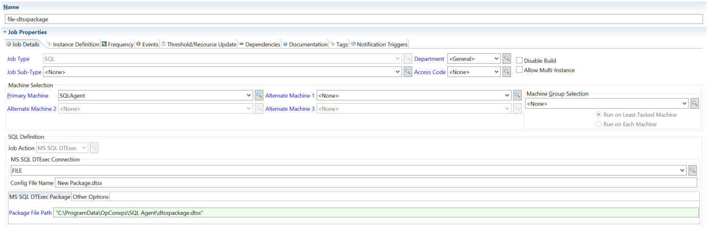

</TabItem>
<TabItem value="sql" label="SQL Connection">

Use **SQL** when the SSIS package is stored in MS SQL Server.

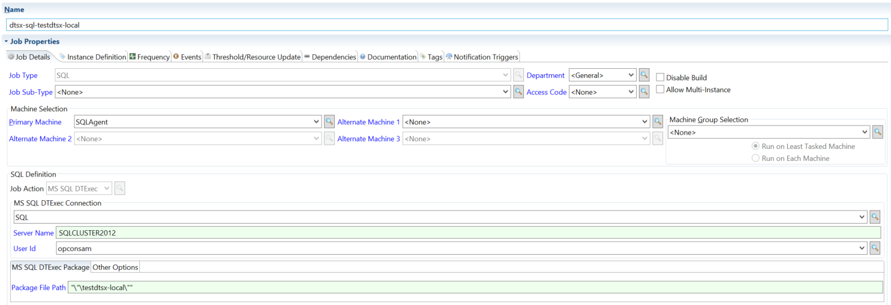

</TabItem>
</Tabs>

---

## MS SQL Job

Start a SQL Server Agent job and control how the SQL Agent monitors it. Each tab shows a different monitoring strategy or option.

For the field reference, see [Fields for MS SQL Job](https://help.smatechnologies.com/opcon/core/rolling/Files/Concepts/SQL-Job-Details.md#Fields_for_MS_SQL_Job) in the **Concepts** online help.

<Tabs groupId="mssql-job-mode">
<TabItem value="completion" label="Monitor until completion" default>

The SQL Agent reports the job's final status when it finishes.

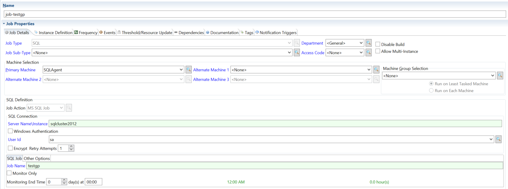

</TabItem>
<TabItem value="running" label="Monitor while running">

The SQL Agent monitors the job only while the SQL Server Agent job is running.

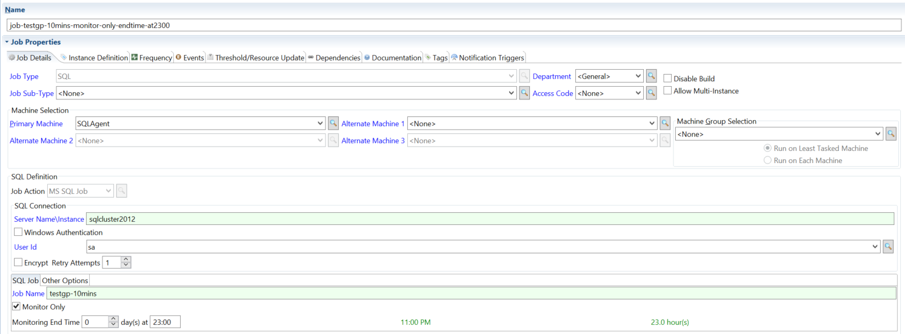

</TabItem>
<TabItem value="endtime" label="Specified end time">

The SQL Agent monitors the job until the run time you specify.

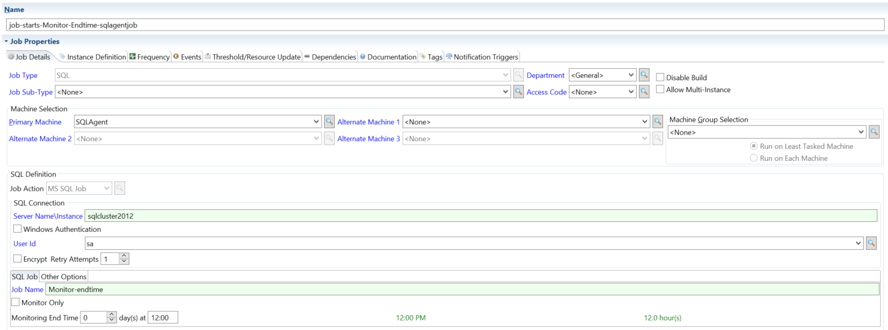

</TabItem>
<TabItem value="password" label="Password overwrite">

Start and monitor a job, overriding the saved credentials with a password supplied at runtime.

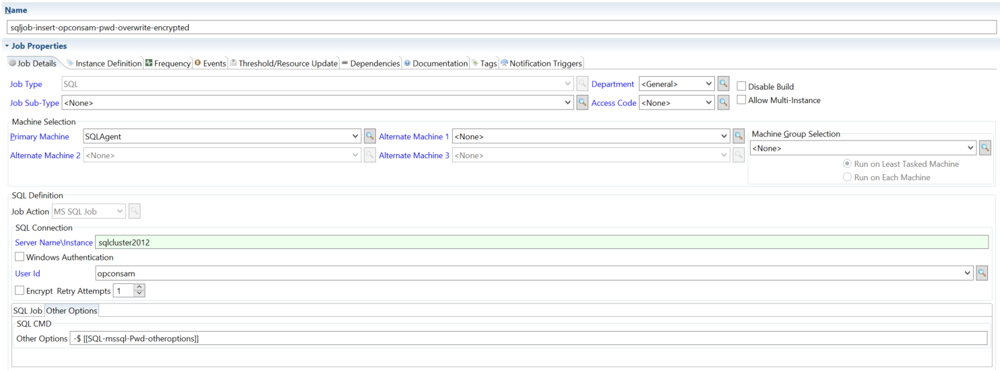

</TabItem>
</Tabs>

---

## MS SQL Script

Run T-SQL against MS SQL Server. The script can be written in line in the job definition or pulled from a `.sql` file. Pick the tab that matches how you want the script and any runtime values supplied.

For the field reference, see [Fields for MS SQL Script](https://help.smatechnologies.com/opcon/core/rolling/Files/Concepts/SQL-Job-Details.md#Fields_for_MS_SQL_Script) in the **Concepts** online help.

<Tabs groupId="mssql-script">
<TabItem value="inline" label="In Line Script" default>

The script is written directly in the job definition.

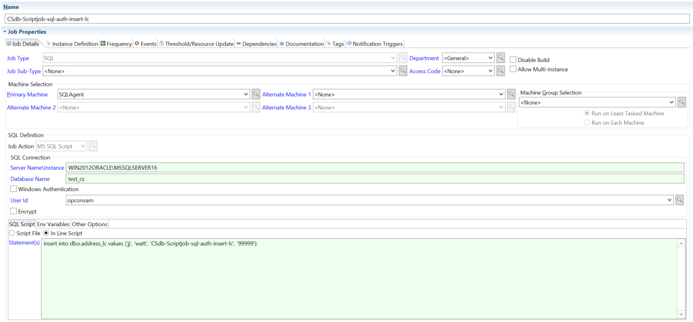

</TabItem>
<TabItem value="envvars" label="Environment variables">

The job passes environment variables into the script at runtime.

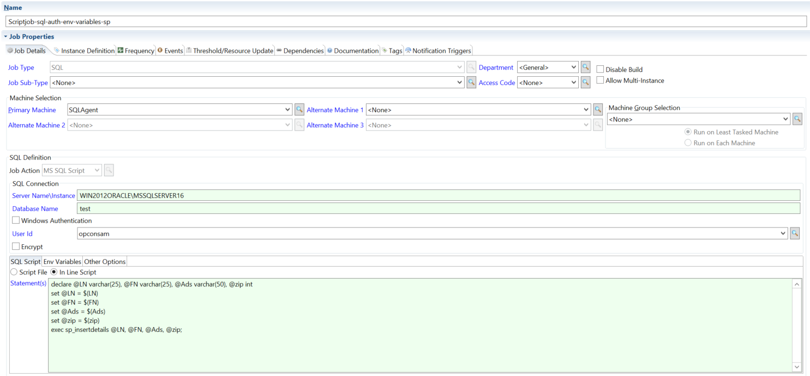

</TabItem>
<TabItem value="inline-envvars" label="In Line Script + variables">

Combines an in-line script with environment variables.

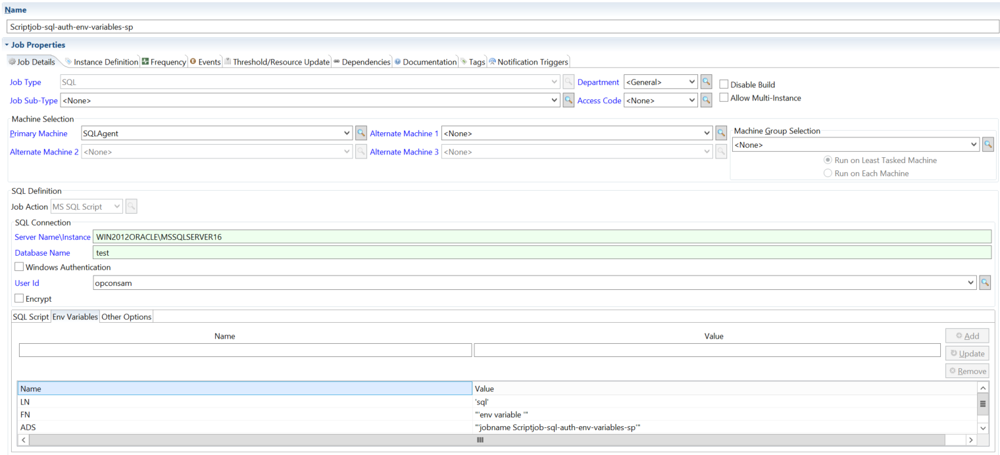

</TabItem>
<TabItem value="output-pwd" label="Output file + password">

Specifies an output file path and applies a password overwrite at runtime.

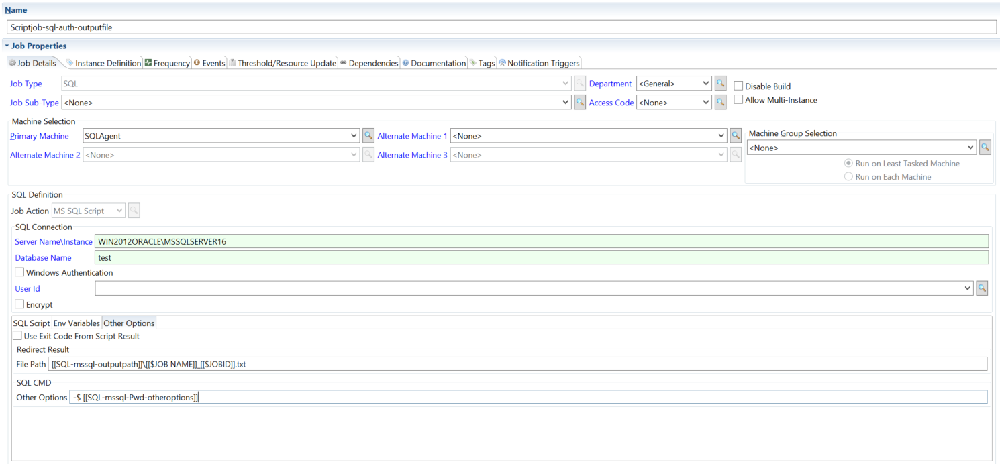

</TabItem>
<TabItem value="winauth-file" label="Windows Auth + script file">

Authenticates with the agent's Windows account and runs a script from a `.sql` file.

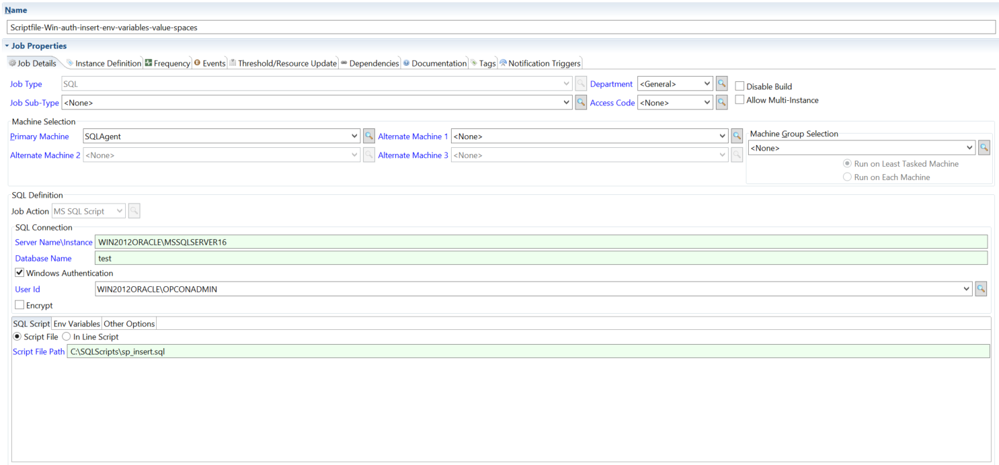

</TabItem>
</Tabs>

---

## MySQL

Run queries or scripts against MySQL. The example tabs show the most common configurations.

For the field reference, see [Fields for MySQL](https://help.smatechnologies.com/opcon/core/rolling/Files/Concepts/SQL-Job-Details.md#Fields_for_MySQL) in the **Concepts** online help.

<Tabs groupId="mysql">
<TabItem value="default-port" label="Default port" default>

Connects to MySQL on the default port.

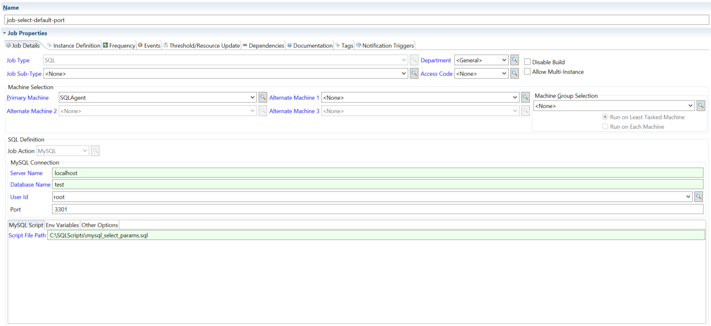

</TabItem>
<TabItem value="password" label="Password overwrite">

Overrides the saved password at runtime.

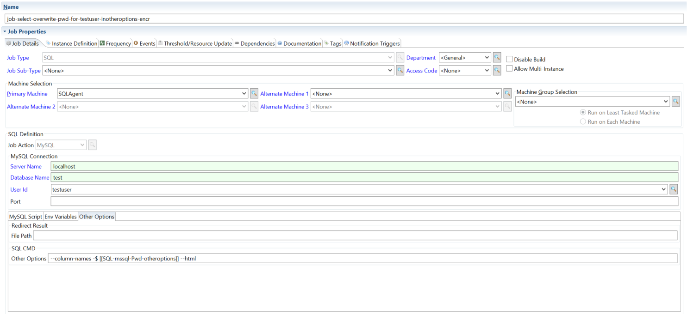

</TabItem>
<TabItem value="envvars" label="Environment variables">

Runs a script file and substitutes environment variables into the SQL.

**Script File Path:** `C:\SQLScripts\mysql_insert_params.sql`

`Mysql_insert_params.sql` script details:

```sql
Insert into address (Lastname, Firstname, Address) values (@LN, @FN, @ADS);
```

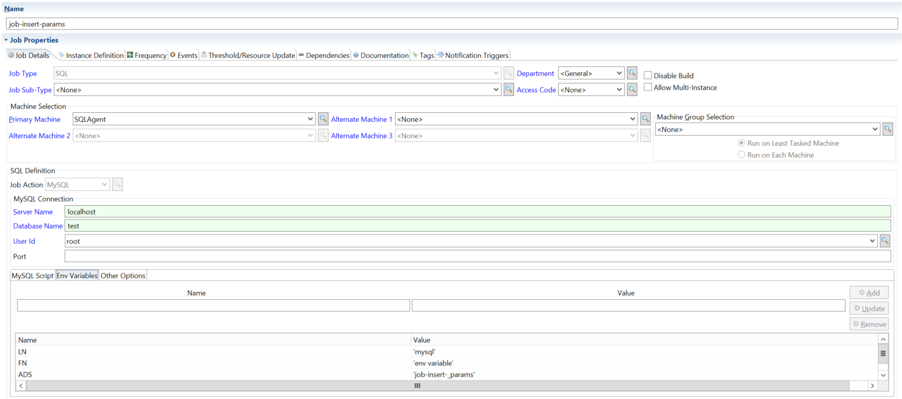

</TabItem>
</Tabs>

---

## Oracle

Run jobs against Oracle. The tabs cover the most common parameter and connection patterns.

For the field reference, see [Fields for Oracle](https://help.smatechnologies.com/opcon/core/rolling/Files/Concepts/SQL-Job-Details.md#Fields_for_Oracle) in the **Concepts** online help.

<Tabs groupId="oracle">
<TabItem value="output-pwd" label="Output file + password" default>

Writes job output to a specified file path and applies a password overwrite.

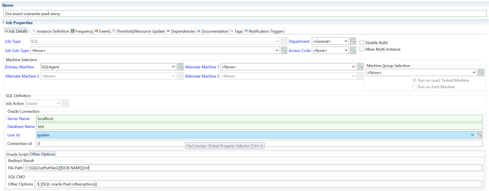

</TabItem>
<TabItem value="parameters" label="Parameters">

Passes parameters into the Oracle job at runtime.

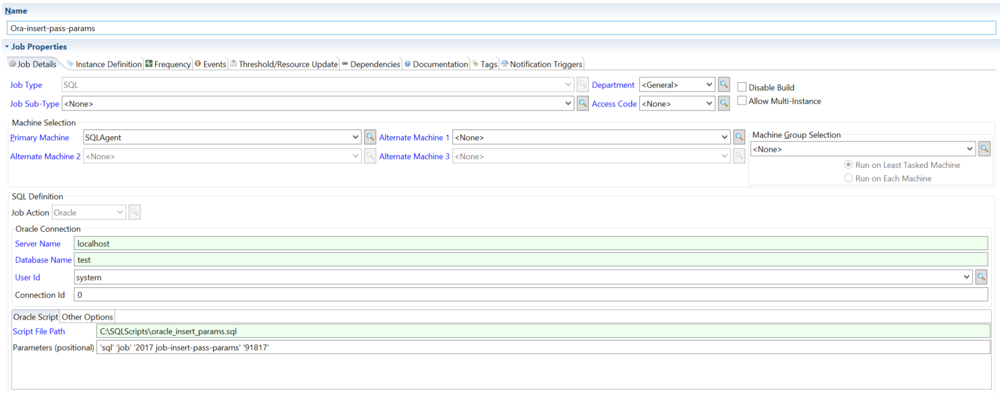

</TabItem>
<TabItem value="encrypted" label="Encrypted parameters">

Passes encrypted parameters into the Oracle job.

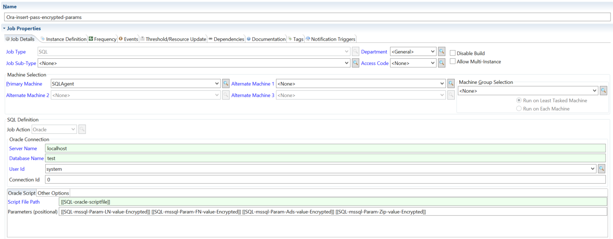

</TabItem>
<TabItem value="connection-id" label="Connection ID">

References a saved Oracle connection by ID rather than entering the connection details inline.

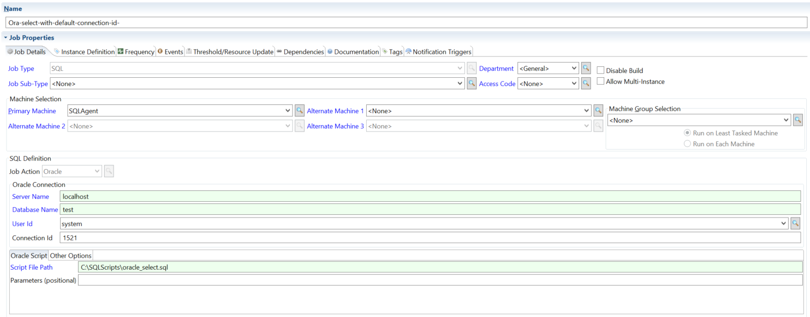

</TabItem>
</Tabs>

---

## Other DB

Connect to any database through ODBC or OLE DB. Use this job action when the database isn't covered by one of the dedicated job types above. The three sub-sections below correspond to the three connection methods.

For the field reference, see [Fields for Other DB](https://help.smatechnologies.com/opcon/core/rolling/Files/Concepts/SQL-Job-Details.md#Fields_for_Other_DB) in the **Concepts** online help.

### DSN Name connections

Connect through a Data Source Name configured on the agent machine.

<Tabs groupId="other-dsn">
<TabItem value="envvars-1" label="Env. variables (1 of 2)" default>

In Line Script with environment variables — first part.

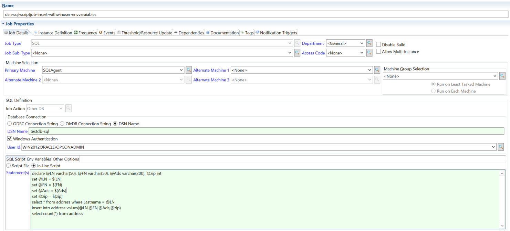

</TabItem>
<TabItem value="envvars-2" label="Env. variables (2 of 2)">

In Line Script with environment variables — second part.

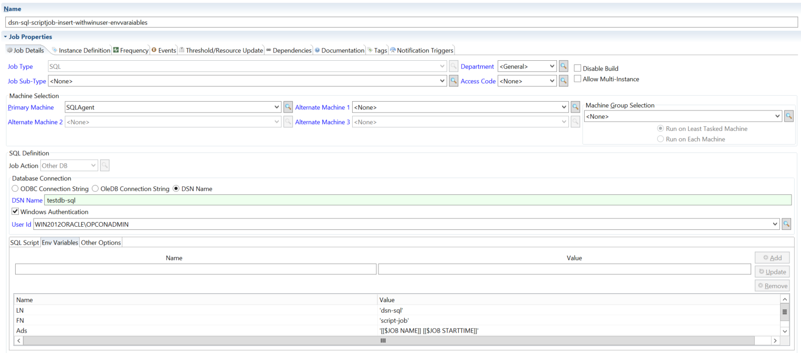

</TabItem>
<TabItem value="password" label="Password overwrite">

DSN Name connection with password overwrite at runtime.

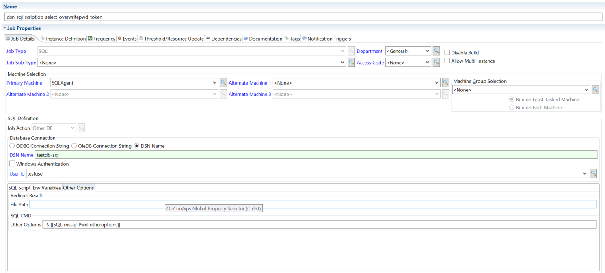

</TabItem>
</Tabs>

### OleDB Connection String

Connect by supplying a full OLE DB connection string in the job definition.

<Tabs groupId="other-oledb">
<TabItem value="inline" label="In Line Script" default>

OleDB connection string with an in-line script.

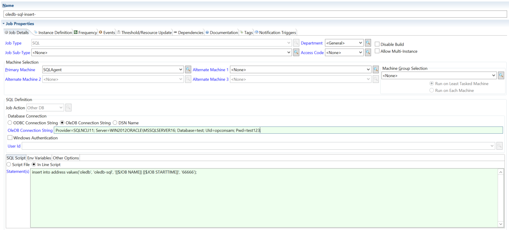

</TabItem>
<TabItem value="scriptfile" label="Script file">

OleDB connection string with a `.sql` script file. The script accepts parameters supplied at runtime.

`Insert-with-params.sql` script file details:

```sql
declare @LN varchar(25), @FN varchar(25), @Ads varchar(50), @zip int;

set @LN = $(LN);

set @FN = $(FN);

set @Ads = $(Ads);

set @zip = $(zip);

select * from address where Lastname = @LN;

insert into address values(@LN,@FN,@Ads,@zip);
```

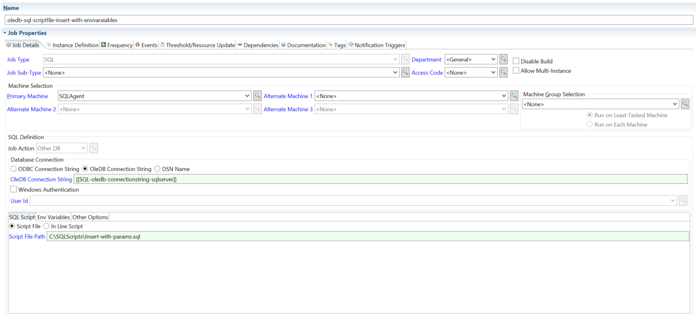

</TabItem>
<TabItem value="envvars" label="Environment variables">

OleDB connection string with environment variables.

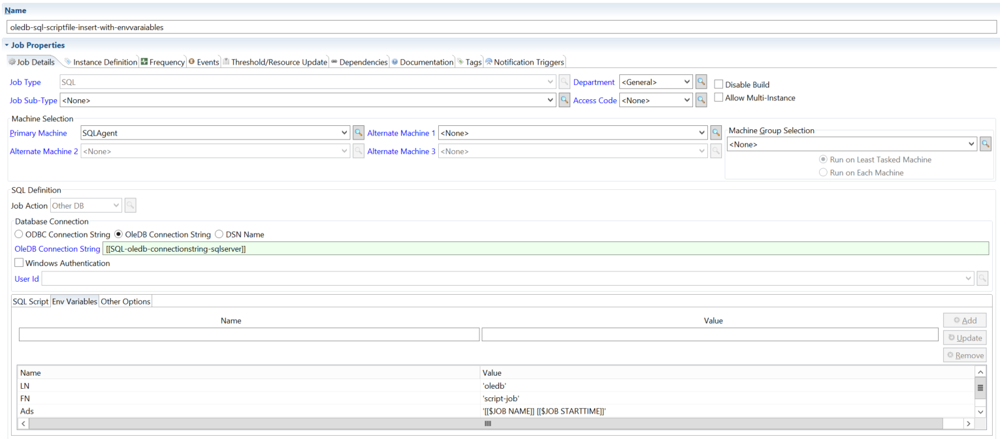

</TabItem>
</Tabs>

### ODBC Connection String

Connect by supplying a full ODBC connection string in the job definition.

<Tabs groupId="other-odbc">
<TabItem value="inline" label="In Line Script" default>

ODBC connection string with an in-line script.

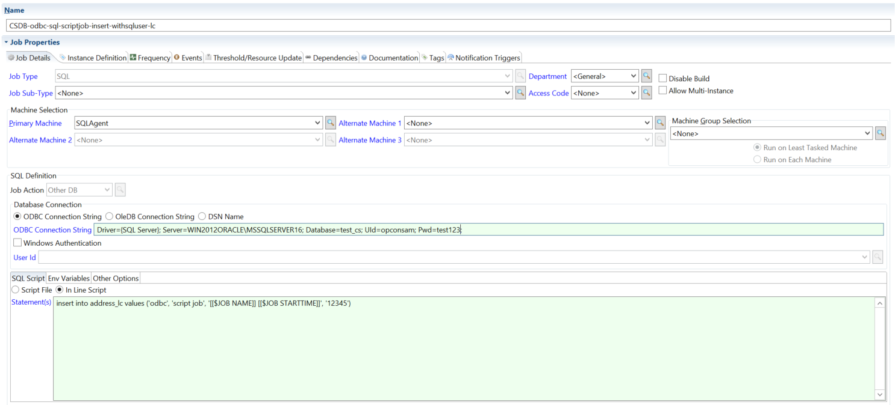

</TabItem>
<TabItem value="envvars" label="In Line Script + variables">

ODBC connection string with an in-line script and environment variables.

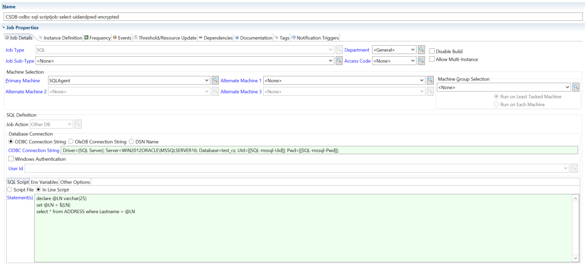

</TabItem>
</Tabs>

---

## Related topics

- [SQL Agent overview](../overview.md)
- [New installation](../installation/new-installation.md)
- [SQLAgent.ini file configuration](../administration/configuration-file.md)
